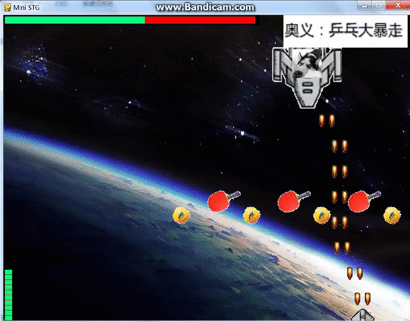
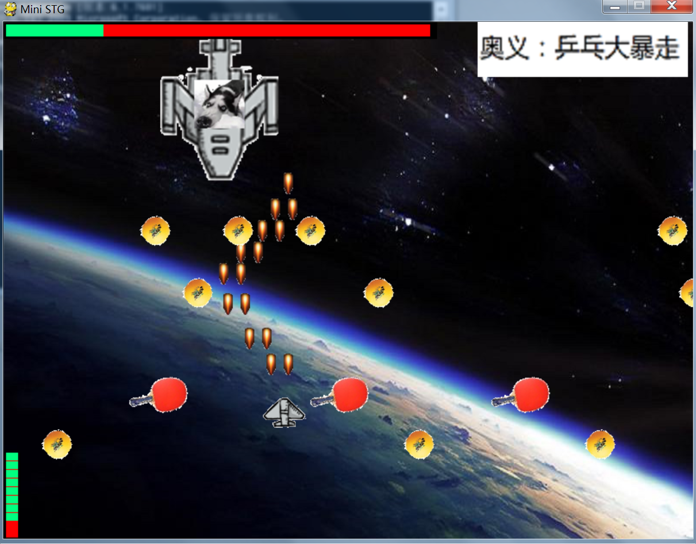
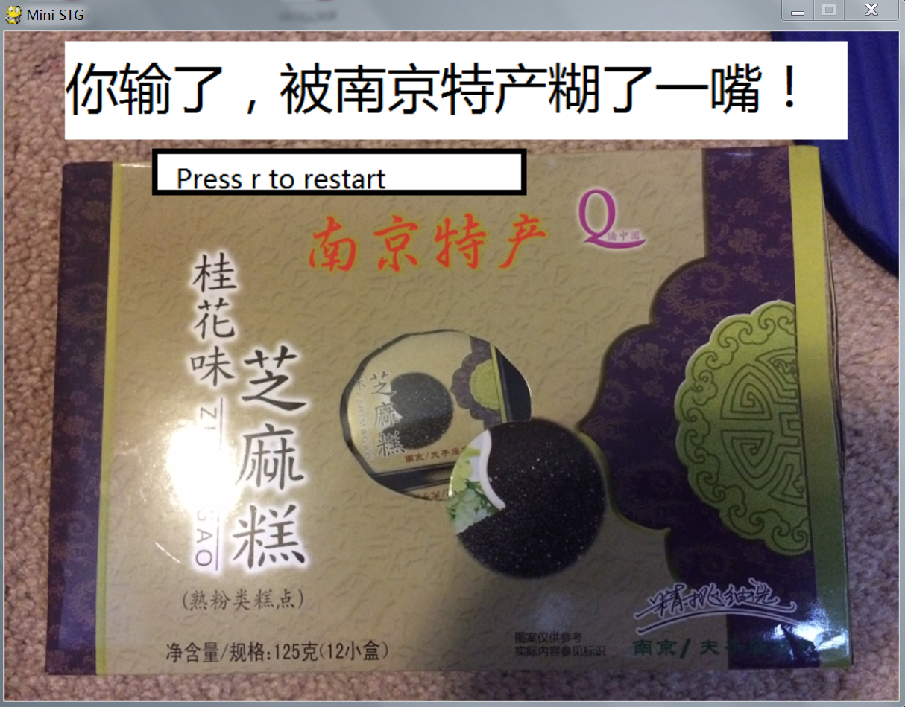

# MiniSTG
a mini game written in python and with pygame
# Requirement
1.python
2.pygame (http://www.pygame.org/download.shtml)
# Reference
http://www.raywenderlich.com/24252/beginning-game-programming-for-teens-with-python
# To Start Game
  
```bash
$ python mainGame.py
```
Make sure to tune the volume to a proper value : )

#Screeshot



